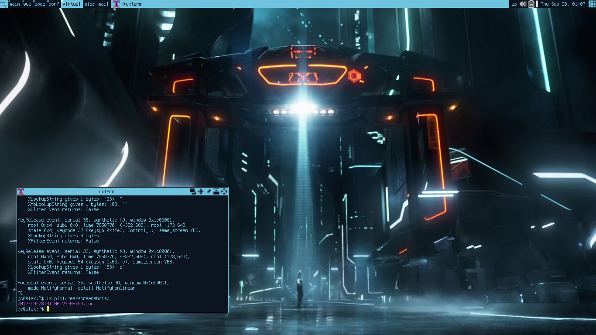

# Awesome

This configurarion requires Awesome 4. Also install some packages with
`luarocks`; widgets are implemented with `vicious`, usually found in the
`awesome-extra` package and menu entries generated with
[xdg_menu](https://wiki.archlinux.org/index.php/Xdg-menu#Awesome)



## pulseaudio_widget

In order to get the pulseaudio widget working make sure pulseaudio loads the
dbus-module

```bash
# echo "load-module module-dbus-protocol" >> /etc/pulseaudio/default.pa
# luarocks install pulseaudio_widget
```
