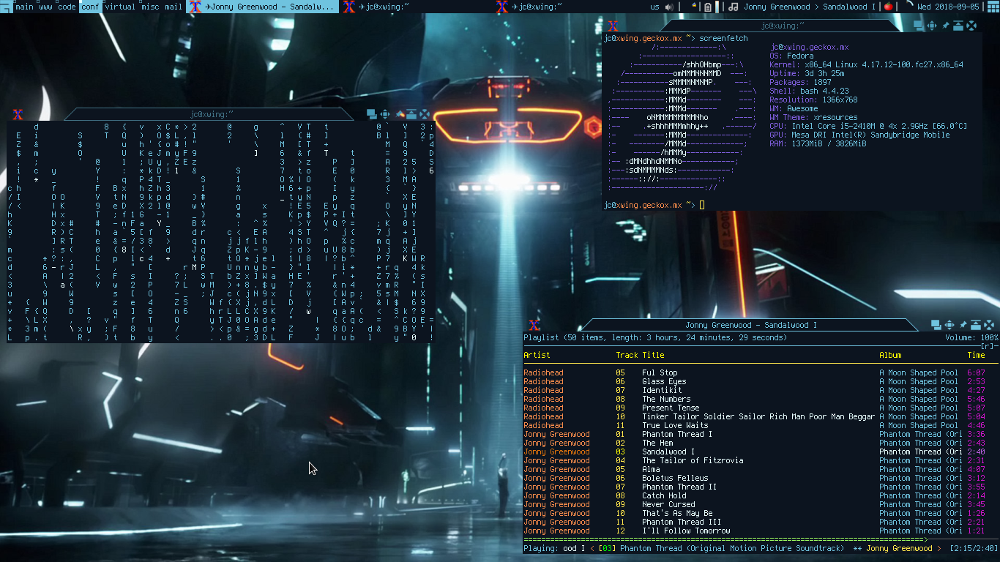

# Awesome

This configurarion requires Awesome 4. Also install some packages with
`luarocks`; widgets are implemented with `vicious`, usually found in the
`awesome-extra` package and menu entries generated with
[xdg_menu](https://wiki.archlinux.org/index.php/Xdg-menu#Awesome)



## Configuration

* Multiple displays, each with a specific set of tags
  * a dedicated [library](https://github.com/Drauthius/awesome-sharedtags)
  * or [home made](https://www.reddit.com/r/awesomewm/comments/6tncxm/first_time_using_multiple_displays_what_are_some/dlmn76k/)

## pulseaudio_widget

In order to get the pulseaudio widget working make sure pulseaudio loads the
dbus-module

```bash
# echo "load-module module-dbus-protocol" >> /etc/pulseaudio/default.pa
# luarocks install pulseaudio_widget
```

## Dev/Test

Debug configuration file on a nested Xorg server (using Xephyr)

```bash
$ Xephyr :5 -ac -br -noreset -screen 600x400 &
$ DISPLAY=:5.0 awesome -c /home/jc/.config/awesome/custom.lua
```
